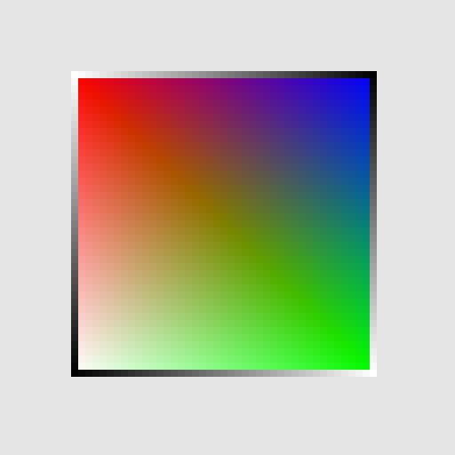

# Rasterizing-Lines-and-Triangles

In this assignment, you will implement rasterization algorithms that allow you to draw lines and solid triangles

# Implementation instructions

We are using a simple framebuffer that you can control using the function setPixel(x, y, color) where x and y specify integer
pixel coordinates along the horizontal and vertical axes respectively, with the top-left corner of the image being the origin. The color
variable is an array containing RGB color values (i.e. color = [R, G, B] ), each represeting as a floating point value in [0,1] .

The assignment uses simple text-driven input to specify what we should rasterize.
We use the following syntax:

- `v,x,y,r,g,b;` specifies a vertex position at `x,y` with color value `color = [r, g, b]` . The order in which lines starting with `v`
are provided defines an index for each vertex v . That is, the first v line is the 0-th vertex, the second line is the 1-th vertex etc.
- `p,i;` specifies a point (i.e. "pixel") defined by the vertex with index `i` .
- `l,i,j;` specifies a line defined by the start and end vertices with index `i` and `j` respectively.
- `t,i,j,k;` specifies a triangle defined by the three vertices with indices `i , j` and `k` .

You can change the contents of the text box to add vertices as well as point, line and triangle definitions using the defined vertices.
Clicking the "Update" button will refresh the image output.
The starter code will produce a single pixel at each vertex.
Your job is to
implement the logic that will rasterize solid lines and triangles with interpolated colors!

1. First, implement line rasterization, for now with a constant color value along the line. Start with handling the simple case of slope less than one, and then extend your code to handle other cases. You may base your implementation on the DDA algorithm, correctly extended to handle lines in all orientations. 

2. Implement color interpolation along the line. Assume linear interpolation along each RGB color channel from the start to the end of the line. To do this, you will need to define a [0,1] "distance" along the line from start to end points and use the fraction covered up to the current point. 

3. Implement a triangle inside-outside test function to determine whether a pixel is inside a triangle.

4. Use the above test to implement triangle rasterization in function drawTriangle . Your implementation should avoid naively checking all pixel points. 

5. Implement barycentric color interpolation to determine the color value at each pixel inside a triangle. 

Be careful to handle cases such as line endpoints starting and ending at higher or lower x and y values, or endpoints falling in
the same pixel.

Also be careful to handle cases such as adjacent triangles sharing an edge (there should be no gaps between such triangles, and pixels should be colored in only once so that the order in which triangles are rasterized does not matter).